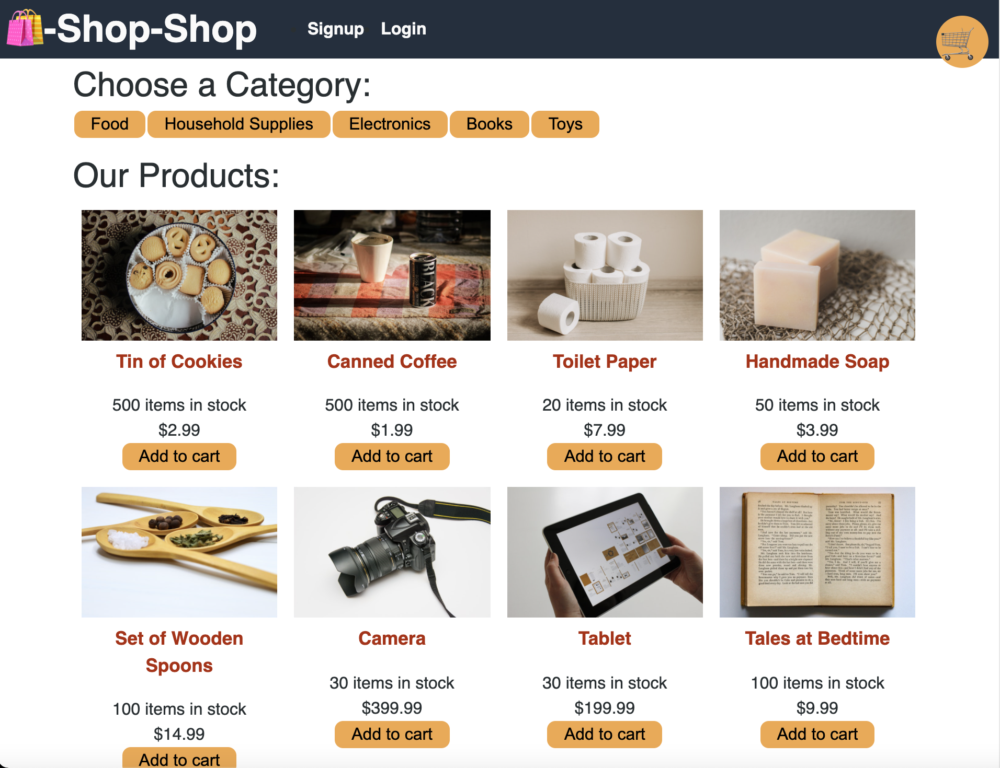

# Redux Store

 

## Description

The [Redux Store](https://github.com/twashke/Redux-Store) was initially created using **Context API** to handle Global State throughtout the application. The code has been refactored to remove the **Context API** and [Redux](https://www.npmjs.com/package/redux) has been added to handle Global State instead. This application is utilizing a MERN stack with [MongoDB](https://www.mongodb.com/), [Express.js](https://expressjs.com/), [React](https://reactjs.org/) and [Node.js](https://nodejs.org/en/). This website allows the user to shop and add items to their shopping cart. In order to access their cart and make changes or checkout, they must **Login** or **Sign Up** with an account.

## Table of Contents

- [About the Project](#about-the-project)
- [Installation](#installation)
- [Usage](#usage)
- [Contributing](#contributing)
- [Tests](#tests)
- [License](#license)
- [Questions](#questions)

## About the Project

- The user can **Sign Up** or **Login** and add items to their cart as they shop.
- The application was reconfigured to use [Redux](https://www.npmjs.com/package/redux) instead of the **Context API** for handling Global State.
- In the **client** folder the following changes were made:

  - The **utils** folder has the following updates:

    - The **store.js** file added to implement [Redux](https://www.npmjs.com/package/redux).
    - The **GlobalState.js** file removed since Context API is no longer being used.
    - The **reducers.js** file was updated to add **initialState**, removed code for **Context API**

  - In the **App.js** file, updated the Provider and added the store.
  - In the **pages** folder, updated the **Detail.js** file to use **useDispatch** and **useSelector**.
  - In the **components** folder, the following files were updated to use **useDispatch** and **useSelector**.

    - **Cart/index.js**
    - **CartItem/index.js**
    - **CategoryMenu/index.js**
    - **ProductItem/index.js**
    - **ProductList/index.js**

- The **server** folder utilizes the following technologies:

  - [Express](https://www.npmjs.com/package/express)
  - [apollo-express-server](https://www.npmjs.com/package/apollo-server-express)
  - [bcrypt](https://www.npmjs.com/package/bcrypt)
  - [graphQL](https://www.npmjs.com/package/graphql)
  - [jsonwebtoken](https://www.npmjs.com/package/jsonwebtoken)
  - [mongoose](https://www.npmjs.com/package/mongoose)
  - [stripe](https://www.npmjs.com/package/stripe)
  - [MongoDB](https://www.mongodb.com/)
  - [Node.js](https://nodejs.org/en/)

- The **client** folder utilizes the following technologies:

  - [React](https://www.npmjs.com/package/create-react-app)
  - [Redux](https://www.npmjs.com/package/redux)
  - [@apollo/client](https://www.npmjs.com/package/apollo-client)
  - [graphQL](https://www.npmjs.com/package/graphql)
  - [HTML](https://www.w3schools.com/html/), [CSS](https://www.w3.org/Style/CSS/Overview.en.html), and [Javascript](https://www.javascript.com/)
  - [Node.js](https://nodejs.org/en/)

- For [Website Deployment](https://reduxstore082021.herokuapp.com/) the following technologies were used:
  - [Heroku](https://heroku.com/)
  - [MongoDB Atlas](https://www.mongodb.com/)
  - [if-env](https://www.npmjs.com/package/if-env)

## Installation

- Open [Redux Store GitHub Repository](https://github.com/twashke/Redux-Store).
- Use the command line to **git clone**
- **npm install**
- **npm run seed**
- **npm run develop** from command line to connect to server and client.
- Go to [localhost:3000](http://localhost:3000/) for client and [localhost:3001/graphql](http://localhost:3001/graphql) for the server while in development.

## Usage

- Go to [Deployed Redux Store Website](https://reduxstore082021.herokuapp.com/)
- Add items to shopping cart.
- Remove Items from shopping cart.
- **Sign Up** or **Login** to checkout using [Stripe](https://www.npmjs.com/package/stripe)

\
[Redux Store](https://github.com/twashke/Redux-Store) Home Page \
\

\
**Add Items** to Shopping Cart \
\

\
**Remove Item** from Shopping Cart \
\

\
**Sign Up** to access the Shopping Cart for Checkout \
\

## Contributing

- Starter code was provided and reconfigured to use [Redux](https://www.npmjs.com/package/redux) to handle Global State instead of the **Context API** it was initially created using.

## Tests

- Testing in local environment once changes were made.
- Testing in Heroku once deployed and seeds added.

## License

This application is covered by the [MIT License](https://opensource.org/licenses/MIT).

      Copyright 2021 Tiffany Washke

      Permission is hereby granted, free of charge, to any person obtaining a copy of this software and associated documentation files (the "Software"), to deal in the Software without restriction, including without limitation the rights to use, copy, modify, merge, publish, distribute, sublicense, and/or sell copies of the Software, and to permit persons to whom the Software is furnished to do so, subject to the following conditions:

      The above copyright notice and this permission notice shall be included in all copies or substantial portions of the Software.

      THE SOFTWARE IS PROVIDED "AS IS", WITHOUT WARRANTY OF ANY KIND, EXPRESS OR IMPLIED, INCLUDING BUT NOT LIMITED TO THE WARRANTIES OF MERCHANTABILITY, FITNESS FOR A PARTICULAR PURPOSE AND NONINFRINGEMENT. IN NO EVENT SHALL THE AUTHORS OR COPYRIGHT HOLDERS BE LIABLE FOR ANY CLAIM, DAMAGES OR OTHER LIABILITY, WHETHER IN AN ACTION OF CONTRACT, TORT OR OTHERWISE, ARISING FROM, OUT OF OR IN CONNECTION WITH THE SOFTWARE OR THE USE OR OTHER DEALINGS IN THE SOFTWARE.

## Questions

**Contact Tiffany Washke**

- **Email directly at** twashke@gmail.com
- **GitHub User Name:** [twashke](https://github.com/twashke)

